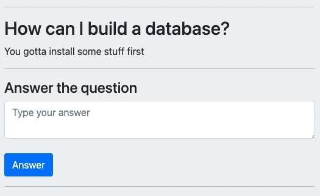

# Ask and answer question application

## Overview
- The main purpose of this project is to build an application that allow people to make questions and answer. The application provides knowledge about my studies on `Node.js`, `EJS` and `MySQL` 

## First step

You need to install frameworks, libraries and database. 

- Download Node.js at `https://nodejs.org/en/download/`

 Then, open your terminal and `run` the following commands:

- Run: `npm install express --save` to install Express framework;

- Run: `npm install ejs --save` to install EJS library to render front-end;

- Run: `mpm install body-parser --save` to translate MySQL bash command into easy steps;

- Run: `npm install sequelize --save` to manipulate our database;

## Second step

- As we use MySQL to build our data base, you can download it at this link if you don't have it already: 
`https://dev.mysql.com/downloads/mysql/ `

- After installing MySQL don't forget to change `YourPassword` with your `Root` credentials at `database/database.js`  as the picture below   

  

  

- To make sure our database is working fine, you can download `WorkBench` from MySQL as well at this link: `https://www.mysql.com/products/workbench/`

- After that, run: `npm install mysql2 --save` to use MySQL API to have better performance

If you are a linux or macos user, you might have to set up the `PATH` from your MySQL folder. To make sure everything is fine, run: `export PATH=${PATH}:/usr/local/mysql/bin/` on `terminal` to make sure everything is fine.

## To run the application

- Go over the `AskAnswerProject` folder on `terminal` and run: `node index.js`

- The server will be available at `localhost:3000`

## Features

- Go on `Ask question` and create one

  

  

  

- And it automatically will appear at the main page:

  

 

- Answer the question

  

- All answers will appear below the question that was made

  

  

- If you want to go back to the main page, you only have to click on the Node.js icon on the top of the page

  

   

## Copyright and license
- Code and documentation copyright 2011–2021 the Bootstrap Authors, Inc. 
- Code released under the MIT License.
